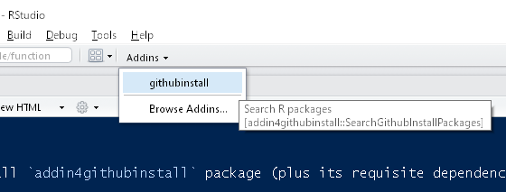

# addin4githubinstall

## Install this addin
You just need to install `addin4githubinstall` package (plus its requisite dependencies) with:
```
devtools::install_github("gepuro/addin4githubinstall")
```

## Running this addin
After installing this package, you should see this addins on toolbar menu.



If you can't not find this addin on `Addins` menu, you may have to load this package explicitly on RStudio console:
```
library("addin4githubinstall")
```

## How to use this addin
Type the package name which you want to search in `Search in Title` box.
After selecting the packages, push `Install` button.

